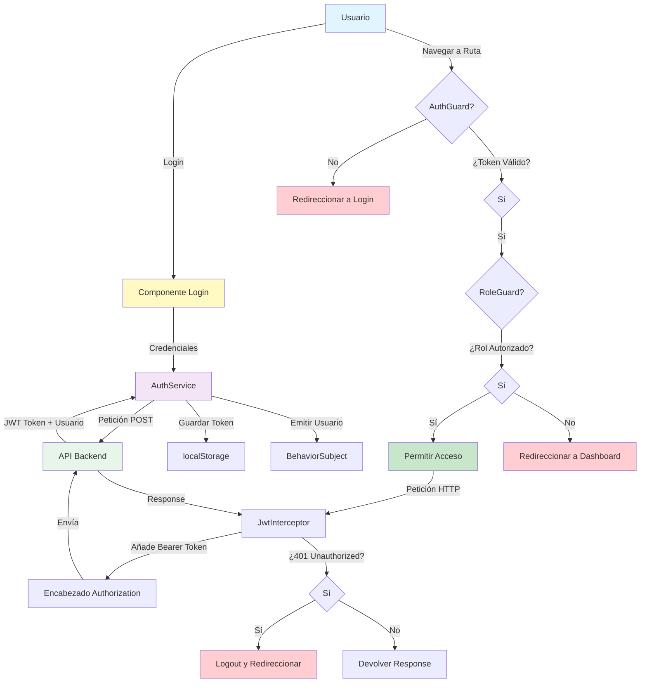

## Flujo de Autenticación y Autorización

### 1. Login
```
Usuario → Login Component → AuthService → API
API → JWT Token + Usuario Data → AuthService
AuthService → Guardar Token (localStorage)
AuthService → Guardar Usuario (localStorage + BehaviorSubject)
```

### 2. Protección de Rutas
```
Navegación a Ruta → AuthGuard
AuthGuard → ¿Token válido y no expirado?
  ✅ Sí → Continuar a RoleGuard
  ❌ No → Redireccionar a /login
```

### 3. Validación de Roles
```
RoleGuard → ¿Rol del usuario incluido en roles requeridos?
  ✅ Sí → Permitir acceso a ruta
  ❌ No → Redireccionar a /dashboard
```

### 4. Peticiones HTTP Autenticadas
```
Petición HTTP → JwtInterceptor
JwtInterceptor → ¿Existe token?
  ✅ Sí → Añadir header: Authorization: Bearer {token}
  ❌ No → Enviar sin token
  
Response → ¿Status 401?
  ✅ Sí → Logout y redireccionar a /login
  ❌ No → Devolver datos
```

## Decodificación de JWT

El token JWT está compuesto por 3 partes separadas por puntos:
```
eyJhbGciOiJIUzI1NiIsInR5cCI6IkpXVCJ9.
eyJzdWIiOiIxMjM0NTY3ODkwIiwiZW1haWwiOiJ1c2VyQGV4YW1wbGUuY29tIiwicm9sIjoiYWRtaW4iLCJpYXQiOjE2NzAwMDAwMDAsImV4cCI6MTY3MDAwMzYwMH0.
TJVA95OrM7E2cBab30RMHrHDcEfxjoYZgeFONFh7HgQ
```

**Parte 1 (Header)**: Algoritmo y tipo
**Parte 2 (Payload)**: Datos del usuario (decodificados con Base64)
**Parte 3 (Firma)**: Verificación del servidor

## Almacenamiento de Datos

### localStorage
```javascript
localStorage.setItem('auth_token', 'eyJhbGc...')      // Token JWT
localStorage.setItem('usuario', JSON.stringify({       // Datos usuario
  id: '123',
  nombre: 'Juan Pérez',
  email: 'juan@educativa.com',
  rol: 'admin'
}))
```

## Ciclo de Vida de Sesión

1. **Inicio**: Usuario hace login
2. **Activo**: Token en localStorage, peticiones autenticadas
3. **Expiración**: Token vence (exp: timestamp)
4. **Inactividad**: Sesión expira después de inactividad
5. **Logout**: Usuario cierra sesión manualmente
6. **Limpieza**: Token y usuario eliminados, redirección a login
